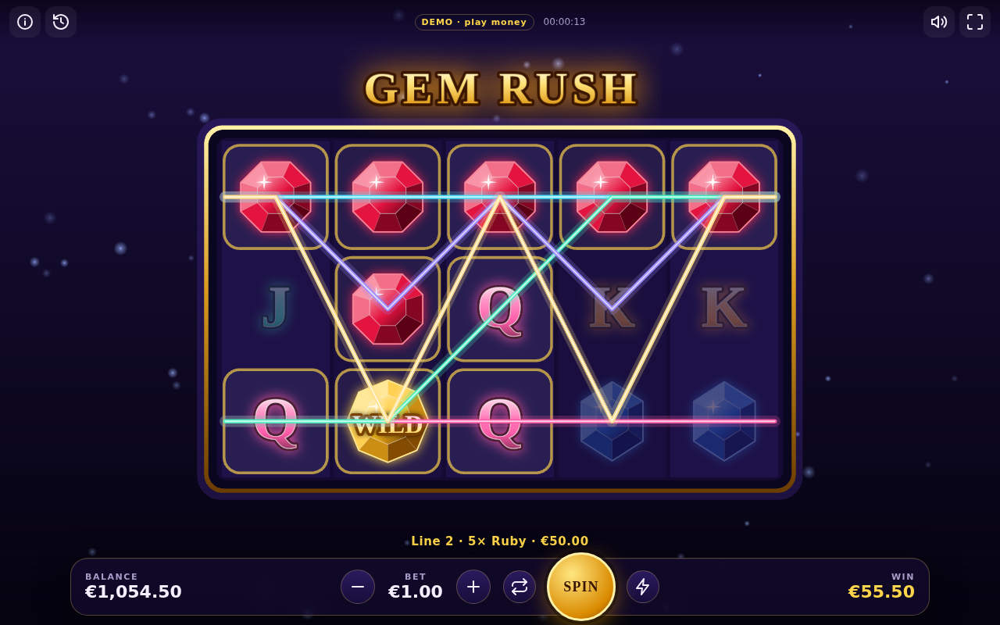
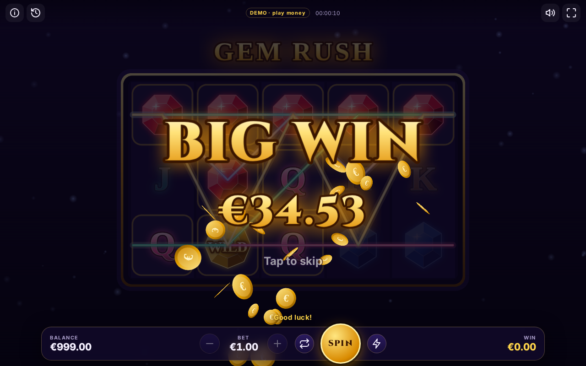
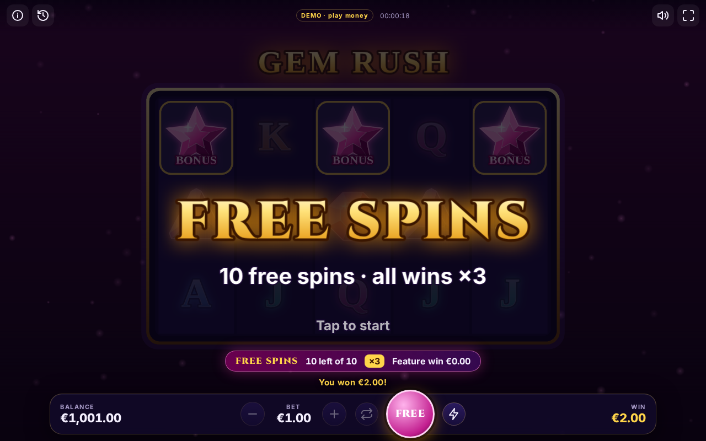
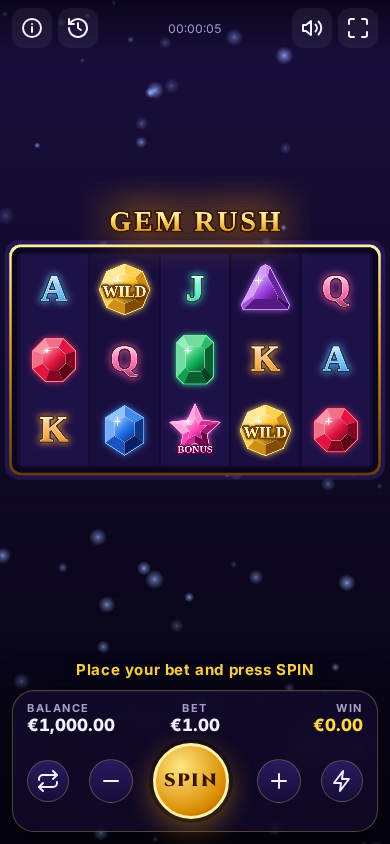
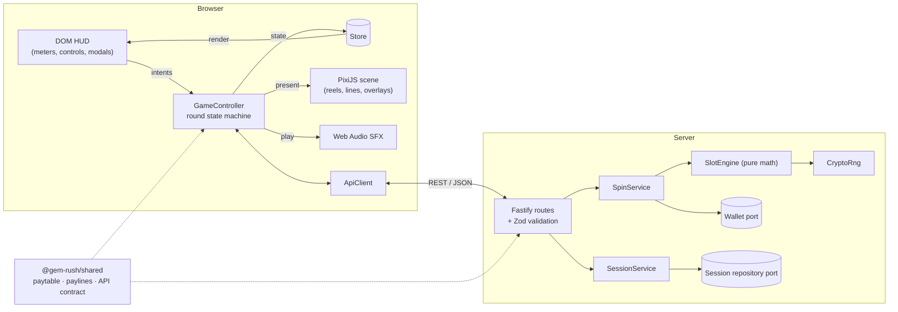

# 💎 Gem Rush — Full-Stack Video Slot

A production-style 5×3, 20-line video slot built as a portfolio piece. It covers the whole stack a real slot studio ships:
an **authoritative game server** with certified-style RNG and verified math, a **PixiJS game client**, and an
**accessible DOM HUD**, all in strict TypeScript with tests, CI and a Docker image.



| Big win celebration                      | Free Spins feature                             | Mobile                                 |
| ---------------------------------------- | ---------------------------------------------- | -------------------------------------- |
|  |  |  |

## Highlights

| Area            | What's in it                                                                                                                                                                                                                          |
| --------------- | ------------------------------------------------------------------------------------------------------------------------------------------------------------------------------------------------------------------------------------- |
| **Game math**   | 96.27% RTP split across base game, Free Spins and a Gem Vault pick bonus, verified two ways: closed-form calculation (exact) and a Monte Carlo simulator running the production engine.                                               |
| **Server**      | Fastify + Zod. Server-side outcomes via `crypto.randomInt` (no modulo bias). Integer money, a wallet port with ledger, per-session round locking, session resume, idle expiry.                                                        |
| **Game client** | PixiJS v8. **Spine 4.3 animated symbols** (land/win, clipped light sweep, pooled). Reel physics, anticipation, slam-stop, paylines with **win amounts**, BIG/MEGA/EPIC wins, Free Spins, **Gem Vault pick bonus**, synthesized audio. |
| **HUD**         | Framework-free DOM layer: balance/bet/win meters, autoplay with a mandatory loss limit, turbo, paytable in real currency, history, keyboard play, responsive layouts, reduced-motion support.                                         |
| **Quality**     | 40+ unit and integration tests, strict TS, ESLint, Prettier, GitHub Actions CI, multi-stage Docker build, QA cheat tool for forced outcomes.                                                                                          |

## Quick start

Requires **Node.js ≥ 22.12**.

```bash
npm install
npm run dev          # server on :3000 + Vite client on :5173 (with API proxy)
```

Open <http://localhost:5173>. Press **Space** or click **SPIN**.

Production build (one process serves the API and the client):

```bash
npm run build
npm start            # http://localhost:3000
# or
docker build -t gem-rush . && docker run -p 3000:3000 gem-rush
```

### Troubleshooting: "Cannot find native binding" (Rolldown / Vite)

npm skipped Vite's platform-specific binary. This usually means the Node version is too old, or the install was
interrupted (npm bug [#4828](https://github.com/npm/cli/issues/4828)). Check `node -v` (needs ≥ 22.12), then reinstall:

```powershell
# Windows PowerShell (macOS/Linux: rm -rf node_modules)
Remove-Item -Recurse -Force node_modules
npm install
```

### QA mode (forced outcomes)

Start the game in QA mode (same command on Windows, macOS and Linux):

```bash
npm run dev:qa
```

Open <http://localhost:5173>. A **QA** panel appears top-left with buttons that force the next spin:
**Free Spins**, **Gem Vault Bonus**, **Big Win** and **Anticipation**. QA mode is refused when
`NODE_ENV=production`, and the panel only appears when the server has cheats enabled.

### Scripts

| Command                       | Purpose                                                      |
| ----------------------------- | ------------------------------------------------------------ |
| `npm run dev`                 | Server (watch) + client (HMR)                                |
| `npm run dev:qa`              | Same, with QA forced outcomes enabled (QA panel in the game) |
| `npm test`                    | Vitest: math, evaluator, services, HTTP API, client logic    |
| `npm run simulate -- 5000000` | Monte Carlo RTP report vs. the exact theoretical value       |
| `npm run spine:build`         | Regenerates the Spine symbol rig (skeleton, atlas, texture)  |
| `npm run lint` / `typecheck`  | ESLint and TypeScript across all packages                    |
| `npm run build` / `npm start` | Production build and server                                  |

## Architecture



```
packages/
├── shared/   Game definition (symbols, 20 paylines, paytable) + typed HTTP contract
├── server/
│   ├── src/domain/       RNG, reel strips, evaluator, SlotEngine, exact-RTP calculator, cheats
│   ├── src/application/  SessionService, SpinService, ports, KeyedMutex, errors
│   ├── src/infrastructure/ In-memory repository & wallet adapters
│   ├── src/http/         Fastify app, routes, validation, error mapping
│   ├── scripts/simulate.ts  Monte Carlo simulator
│   └── test/             Vitest suites
└── client/
    ├── src/game/         Pixi scene: reels, symbols, frame, background, overlays
    ├── src/game/spine/   Spine symbol pool + asset contract
    ├── tools/spine/      Spine rig generator (art → atlas → skeleton JSON)
    ├── public/spine/     Generated Spine assets (symbols.json / .atlas / .png)
    ├── src/hud/          DOM HUD + modals (paytable, autoplay, history)
    ├── src/controller/   GameController (round flow) + state types
    ├── src/audio/        Procedural Web Audio SFX
    ├── src/net/          Typed API client, token storage
    └── src/config/       Presentation tuning (timings, win tiers)
```

**Key decisions**

- **The server is the source of truth.** The client never generates outcomes or does money math: it asks for a spin
  and animates the answer. Reel strips (the odds) never leave the server; the client spins visual filler and lands on
  the returned grid.
- **The math core is pure.** `SlotEngine` has no I/O, so tests, the simulator and production all run the same code path.
- **Ports and adapters.** Wallet and session storage are interfaces. Swapping the in-memory adapters for Redis or an
  operator's remote wallet touches only `container.ts`.
- **Integer money.** All amounts are cents. Every bet level is a multiple of 20 lines, so line bets are whole numbers.
- **Unidirectional UI.** The HUD renders from a store and emits intents. Only the controller mutates state.
- **Spine symbols with a real asset pipeline.** `tools/spine` generates a Spine 4.3 rig (one skeleton, a skin per
  symbol, `idle`/`land`/`win` animations) as the same `.json` + `.atlas` + `.png` files the Spine Editor exports, so an
  animator can drop in replacements. Reels draw static sprites **baked from the rig's setup pose**, and only symbols
  that are landing or winning borrow a pooled Spine instance. See
  [tools/spine/README.md](packages/client/tools/spine/README.md).
- **Generated art and audio.** Symbol art, effects and sounds are produced in code, so every asset is reproducible
  and can be tweaked without design tools.

## API

| Method & path                  | Auth   | Description                                                               |
| ------------------------------ | ------ | ------------------------------------------------------------------------- |
| `GET /api/health`              | –      | Liveness probe                                                            |
| `GET /api/game`                | –      | Public game definition + theoretical RTP (no reel strips)                 |
| `POST /api/sessions`           | –      | Creates a guest session → `{ token, state }`                              |
| `GET /api/sessions/me`         | Bearer | Balance, Free Spins in progress and last round (for resume after reload)  |
| `POST /api/spin`               | Bearer | `{ bet, cheat? }` → `{ outcome, balance, freeSpins, featureEnded }`       |
| `POST /api/sessions/me/refill` | Bearer | Demo top-up, only allowed when the balance is below the minimum bet       |
| `POST /api/bonus/pick`         | Bearer | `{ tile }` → opens a Gem Vault tile: `{ pick, balance, bonus, finished }` |
| `GET /api/history`             | Bearer | Last 50 rounds                                                            |

Errors always look like `{ "error": { "code": "INSUFFICIENT_FUNDS", "message": "…" } }`. Types for every payload live in
[`packages/shared/src/api/contracts.ts`](packages/shared/src/api/contracts.ts).

## Further reading

- [docs/GAME_MATH.md](docs/GAME_MATH.md): paytable, reel strip weights, RTP breakdown and how it's verified
- [docs/GAME_DESIGN.md](docs/GAME_DESIGN.md): the player-experience and responsible-gaming decisions behind the UX

---

_Demo game using play money only. No real-money gambling._

_The Spine runtimes are used under the [Spine Runtimes License](http://esotericsoftware.com/spine-runtimes-license),
which requires a Spine Editor license for products that integrate them. Cinzel font: SIL Open Font License 1.1._
